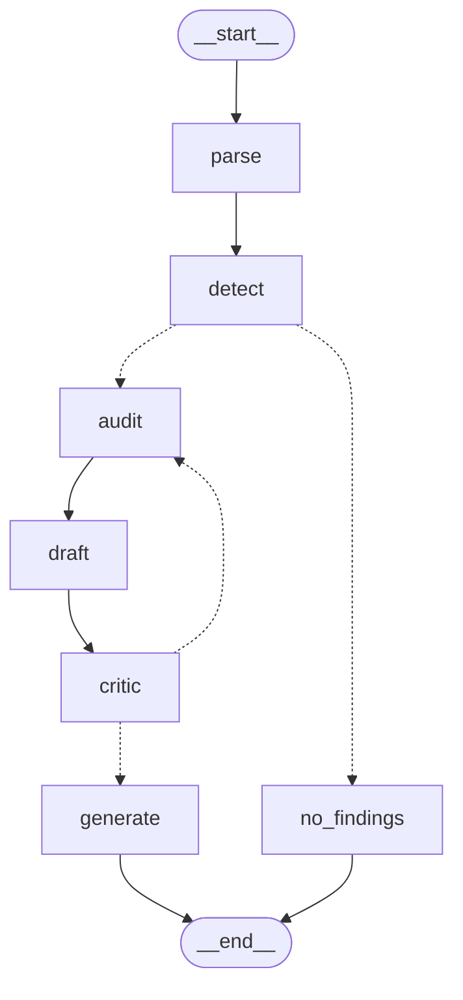

# FinGuard Orchestrator

Enterprise agentic wealth management compliance & AML audit engine.

Ingests batch transaction logs (SWIFT/ISO 20022) and regulatory corpora, audits them
against a semantic compliance knowledge base with a stateful LangGraph agent, and emits
structured Suspicious Activity Reports backed by verifiable citations.

Full design: [`docs/Karthik Project 1 Blueprint.pdf`](docs/).

## Stack

- **Python 3.11**, managed with [`uv`](https://docs.astral.sh/uv/)
- **LangGraph / LangChain** — stateful multi-agent graph (extraction → AML audit → critic → generation)
- **ChromaDB** — vector store for the regulatory knowledge base
- **Redis** — vector semantic cache
- **FastAPI** — async serving layer
- **Streamlit** — auditor cockpit UI
- **LangSmith / DeepEval / RAGAS** — tracing and evaluation

## Layout

```
src/
  ingestion/   # dataset acquisition, PDF parsing, semantic chunking, ChromaDB loading
  graph/       # LangGraph state, nodes, edges
  api/         # FastAPI service
  ui/          # Streamlit cockpit
  utils/       # SWIFT log generator, semantic cache
tests/         # pytest + DeepEval eval suite
data/          # MANIFEST.json + document map tracked; raw/ and processed/ gitignored
docs/          # project blueprint
```

## Getting started

```bash
# install uv (once) — macOS
brew install uv
# other platforms: curl -LsSf https://astral.sh/uv/install.sh | sh

uv sync
cp .env.example .env   # then fill in keys
```

**Phase 1 needs no credentials.** Dataset acquisition, chunking and the `minilm` retrieval
benchmark all run offline. `OPENAI_API_KEY` is only needed for the `text-embedding-3-small`
benchmark arm and, later, the LangGraph nodes (§4) and DeepEval judge (§8). Everything else
in `.env.example` ships with a working default.

## Commands

`pyproject.toml` has no `scripts` section -- Python packaging has no equivalent of one. The
runnable commands are declared as `[project.scripts]` console entry points instead, so `uv sync`
puts each on PATH:

| command | does | needs a key |
|---|---|---|
| `finguard-download` | fetch both corpora, write `data/MANIFEST.json` | no |
| `finguard-map` | map ObliQA DocumentIDs to document titles | no |
| `finguard-ledger` | render the SWIFT MT103 monthly logs | no |
| `finguard-chunk` | semantic chunking -> `data/processed/chunks/*.jsonl` | only `--backend openai` |
| `finguard-benchmark` | recall@k against the 2,786-question gold set | only `--backend openai` |
| `finguard-store` | build / inspect / query the ChromaDB collection | no |
| `finguard-parse` | MT103 batch -> wires, with per-batch stats | no |
| `finguard-detect` | wires -> candidate patterns | no |
| `finguard-audit` | batch PDF -> `ComplianceReport` | **yes** |

`finguard-audit` also draws its own graph without running a batch:

```bash
uv run finguard-audit --ascii            # terminal diagram, fully offline
uv run finguard-audit --mermaid          # mermaid source, for docs or mermaid.live
uv run finguard-audit --png docs/graph.png   # posts the node names to mermaid.ink to render
```

Every one of them is also reachable the long way -- `uv run python -m src.graph.graph` is exactly
`uv run finguard-audit` -- which is what to use if you are running from a checkout you have not
synced. The Streamlit panel is not a console script, since it needs Streamlit's own runner:

```bash
uv run streamlit run src/ui/ingestion_panel.py
```

## Data

Two corpora, acquired by script. Neither is committed — `data/raw/` and `data/processed/`
are gitignored — but `data/MANIFEST.json` records the source URL, sha256, size, licence and
retrieval date of every artifact, so the ~1 GB is reproducible from a few KB of tracked JSON.

```bash
uv run finguard-download          # fetch both corpora, write the manifest
uv run finguard-download --check  # verify what's on disk against the manifest
uv run finguard-map               # map ObliQA DocumentIDs to document titles
uv run finguard-ledger            # render SWIFT MT103 monthly logs
```

Nothing here needs credentials. SAML-D is a public Kaggle dataset, and `kagglehub` falls back
to an unauthenticated client when no token is configured. If Kaggle ever refuses the anonymous
download (rate limiting, or a licence you must accept in the browser first), create a token at
kaggle.com → Settings → API → *Create New Token*, save it as `~/.kaggle/kaggle.json`, and
re-run — the script picks it up automatically.

**A. Transaction ledger — [SAML-D](https://www.kaggle.com/datasets/berkanoztas/synthetic-transaction-monitoring-dataset-aml)**
9,504,852 transactions × 12 features, Oct 2022 – Aug 2023, labelled with 28 typologies
(11 normal / 17 suspicious) at a 0.10% suspicious base rate.

`src/utils/pdf_generator.py` turns it into the auditor's actual input: monthly *"Private
Banking Institutional Transaction Logs"* of SWIFT MT103 messages (blocks 1/2/3/4 — BIC
headers, `:20:` reference, `:32A:` value date/currency/amount, `:50K:` ordering customer,
memo lines). It selects whole laundering *cases* rather than isolated flagged rows, and how a
case is found depends on the typology's shape:

- **anchored** — one account concentrates the run (Structuring is a fan-in of many senders
  into one collector; Smurfing is one sender repeating sub-threshold deposits)
- **chained** — the pattern is a path, `A → B → C → A`, walked through the transaction graph.
  Cycle's 382 flagged edges span 382 distinct senders *and* 382 distinct receivers, so no
  account concentrates and anchoring finds nothing.
- **single wire** — the pattern *is* one transaction (Over-Invoicing at £1.1M–12.6M); the
  signal is the implausible amount, not a repeated shape.

So each log contains a pattern that can actually be detected. Ground truth is written to
`data/processed/ledger_labels.csv`, never into the documents.

**B. Regulatory knowledge base** — chunked into ChromaDB by §3.3/§3.4:

| Source | Content |
|---|---|
| [ObliQA / ADGM](https://github.com/RegNLP/ObliQADataset) | 40 ADGM rulebooks, 13,732 passages, ~876k words. DocumentID 1 is the AML Rulebook. |
| ObliQA test split | 2,786 questions labelled with 3,666 relevant passages — the retrieval gold set (§3.3). All 3,666 resolve against the corpus. |
| FINRA Rule 3310 / 3110 | Rule text, scraped — FINRA publishes its rulebook as HTML only. |
| FINRA Regulatory Notice 19-18 | 104 money laundering red flags for broker-dealers (PDF). |
| FinCEN alerts (×3) | Shell company, real estate and sanctions-evasion red flags (PDF). |

ObliQA carries no document titles and its files are not in DocumentID order, so
`src/ingestion/obliqa_map.py` recovers the mapping by matching passage text and writes
`data/obliqa_document_map.json` — without it every citation would read "Document 1, §1.1.1".

## Semantic chunking (§3.3)

```bash
uv run finguard-chunk --backend minilm  # -> data/processed/chunks/minilm.jsonl
uv run finguard-benchmark               # recall@k against the gold set
```

Two ingestion paths, because the corpora differ structurally. **ObliQA passages are already
split** — one legal clause each, carrying a `PassageID` (`14.2.3.Guidance.1.`) that is exactly
the `section_clause` §3.4 needs and §6.4's citations drawer shows. Re-chunking them would
degrade every citation to "somewhere in 14.2.3", so that path normalizes and filters, and only
reaches for the cosine chunker on the 74 oversized passages. **The four PDFs and two scraped
FINRA rules** are continuous prose with no section IDs — that is where the blueprint's
cosine-distance rule actually applies. **92.1% of chunks pass through whole** — only 7.9% are
produced by splitting.

The threshold is the p95 of *each document's own* adjacent-sentence distances, not a constant:
a dense rulebook and a discursive advisory have different baseline similarity.

What the corpus needed before it could be embedded:

| | |
|---|---|
| 692 empty + 1,510 heading-only passages (16%) | dropped |
| 1,947 passages carrying invisible chars — U+200E ×4,467, U+F0FC ×971 (a Wingdings bullet) | stripped |
| 228 passages needing a split — 109 over 2,000 chars, 84 containing a table, 35 both; the GLO glossary is one 152,049-char passage | tables row-split with the header repeated, prose cosine-split |
| 17 `(DocumentID, PassageID)` keys collide across 44 passages with *different* text | `chunk_id` carries the passage UUID |
| FINRA 19-18 prints `May 6, 201919-18` on 6 of 12 pages | page furniture stripped |

**Result: 12,273 chunks** (median 307 chars, max 2,000), every one citable.

### Measured retrieval quality

ObliQA ships labelled questions, so chunking is measured rather than eyeballed:

| backend | chunks | hit@1 | hit@5 | hit@15 | recall@5 | recall@15 | MRR |
|---|---|---|---|---|---|---|---|
| **`all-MiniLM-L6-v2`** *(in use)* | 12,273 | 45.2% | 67.7% | 79.2% | 60.9% | 71.6% | 0.552 |
| `text-embedding-3-small` | 12,273 | 51.7% | 73.0% | **82.8%** | 65.8% | 75.1% | **0.610** |

OpenAI wins by +3.6 hit@15 and +0.058 MRR. Adoption is **deferred to the post-project
optimization pass** — Phase 1 stays free, offline and credential-free, and the choice is better
judged end-to-end once the agent can be scored on report quality rather than retrieval rank
alone. Both chunk sets are on disk and the collection records which model built it, so switching
is `store.py --backend openai --rebuild`, not a refactor.

Worth noting the gap is almost purely embedding quality: 97.5% of chunks are byte-identical
across the two runs, since `max_chars` fixes how many pieces an oversized passage yields while
cosine distance only shifts where the cut lands.

**Ceiling to carry forward: 17.2% of questions have no correct clause in the top 15.** §9.4's
reranker prunes 15 → 4; it cannot add. No prompt or critic loop recovers those.

> A tier 1+2 filter scores 39.2% hit@15 — but **50% of gold passages live in tier 3**, capping
> it at 50.0%. Normalised that is 78.4% of achievable vs 79.2% unfiltered: retrieval quality is
> unchanged. These questions cover the whole ADGM rulebook, so this gold set validates chunking
> and embeddings but *cannot* validate the AML tier filter — that needs §8's AML scenarios.

## Vector store (§3.4)

```bash
uv run finguard-store                           # build the `regulations` collection
uv run finguard-store --stats                   # counts by corpus and tier
uv run finguard-store --query "transactions structured to avoid reporting thresholds"
uv run streamlit run src/ui/ingestion_panel.py  # ingestion metrics + rule inventory
```

**One collection, 12,273 vectors, 46 documents.** Cosine space, idempotent upsert keyed on
`chunk_id`, and every chunk carries the metadata that makes a citation checkable:

```python
{"source_file": "AML_VER09.211223.txt", "section_clause": "14.2.3.Guidance.1.",
 "last_updated_date": "2023-12-21", "corpus": "obliqa", "document_id": 1,
 "document_title": "AML Rulebook", "relevance_tier": 1, "jurisdiction": "ADGM"}
```

| | |
|---|---|
| by corpus | obliqa 12,122 · finra 65 · fincen 86 |
| by tier | 1: 3,872 · 2: 1,796 · 3: 6,605 |
| undated | 185 chunks, from the 4 ADGM documents that state no date |

`retrieve(query, k=15, tiers=None)` is what §4's AML Audit node calls. The collection records
which embedding model built it and **raises** if queried with another — 384-dim and 1,536-dim
vectors describe the same text in incompatible spaces, and the failure mode to avoid is silent
nonsense rather than an error.

> Transactions are **not** embedded. Measured on 220 MT103s, laundering and clean wires separate
> by +0.029 cosine — noise. An MT103 is ~65 tokens of which ~55 are boilerplate. Parsed wires
> belong in a table queried with SQL.

> SAML-D is licensed **CC BY-NC-SA 4.0** (non-commercial, attribution required):
> B. Oztas, D. Cetinkaya, F. Adedoyin, M. Budka, H. Dogan and G. Aksu, "Enhancing Anti-Money
> Laundering: Development of a Synthetic Transaction Monitoring Dataset," *2023 IEEE ICEBE*,
> pp. 47–54, doi:10.1109/ICEBE59045.2023.00028

## LangGraph agent core (§4)

```bash
uv run finguard-audit --batch data/processed/ledger/2023-06_private_banking_log.pdf
```

Seven nodes turn a batch of 220 MT103 messages into a `ComplianceReport`. **Four are free and
three call a model** -- the organising rule is that anything with a right answer is code, and only
judgement is bought. Three is the count when the critic passes first time; each refinement adds a
draft and a critic call, so a run that loops once costs five.



Solid edges are unconditional; dotted ones are `add_conditional_edges`, where a Python function
picks the destination at run time. `uv run finguard-audit --ascii` draws the same graph in the
terminal, `--png FILE` renders it via mermaid.ink.

| node | cost | what it decides |
|---|---|---|
| `parse` | free | text -> typed `Wire`s. A *malformed* message escalates alone to `gpt-4o-mini`; the other 219 stay free |
| `detect` | free | four shape primitives over the wires -> candidates |
| `route_after_detect` | free | no candidates -> `no_findings`, **END at $0.00** |
| `audit` | free | candidate geometry -> obligation-shaped queries -> ChromaDB |
| `draft` | `gpt-4o` | findings connecting patterns to clauses |
| `critic` | `gpt-4o` | Python citation veto, then a support score |
| `generate` | `gpt-4o` | the filing schema |

The backward edge `critic -> audit` is the only reason this is a graph rather than a chain. It
returns to *retrieval*, not to drafting, because a thin finding is usually missing law rather
than bad writing -- and a template cannot fix that, since it would ask the identical question
again. Two refinements, then it ships with its reservations recorded.

**The audit node buys nothing.** Queries are templates keyed on `candidate.shape`, because Phase 1
measured that phrasing decides retrieval: the same facts ranked the correct clause 11,268/12,273
as raw JSON, 315th as a narrative and **5th** as an obligation. Only the critic's reformulated
query is model-written, and only on a loop-back.

### What is enforced in Python, not asked of the model

- **The citation veto.** Every clause a draft cites is checked against what was actually
  retrieved. One that is not there is a fabrication and the score becomes `0.0` -- a veto, not a
  penalty. Arithmetic, so it runs on every commit rather than being admired once.
- **`flagged_wires` and `source_document_hashes`** are derived from the ledger and the retrieved
  set. Asked for them directly the model returned account numbers in a field specified as wire
  references, and an empty hash list beside a live citation.
- **`risk_rating` is capped at Medium below `HIGH_RISK_CONFIDENCE`.** High means *file a SAR*, so
  it has to clear the critic's top band rather than merely score enough to stop the loop.
- **Retrieval merges by reciprocal rank fusion.** Distances from different queries are not
  comparable -- on June the seven queries' best hits span 0.3433 to 0.4827, so a raw distance sort
  ranks *how easy the question was* above *how good the answer is*. RRF moves the clause June
  cites from rank 20 to 10. The refinement query gets reserved seats, because after seven queries
  no single new list can out-score the incumbents.

### Measured

Parser: **880/880 wires across four batches**, every field matching `ledger_labels.csv`, PDF and
TXT identical. Detectors: **100% recall (52/52 laundering wires), 32% precision**, 164/660 swept.

Recall is the metric that matters -- a missed launderer is a regulatory failure, a false alarm
costs an analyst minutes. Detector precision work is deferred.

Live runs, one per batch, three `gpt-4o` calls each:

| batch | laundering (truth) | candidates | queries | critic passes | confidence | risk |
|---|---|---|---|---|---|---|
| 2023-05 *(clean control)* | 0 | 1 | 3 | 2 | 0.50 | Medium |
| 2023-06 | 21 | 7 | 8 | 2 | 0.50 | Medium |
| 2023-07 | 23 | 16 | 8 | 2 | 0.50 | Medium |
| 2023-08 | 8 | 6 | 7 | 1 | 0.75 | Medium |

**Known limitation, recorded rather than hidden:** the rating does not yet separate a clean batch
from a dirty one -- all four read Medium, and May's single candidate is a legitimate GBP 337,217
consultancy fee at 53.7x the batch median. Before the cap it read *High, file a SAR*, while July
with 23 laundering wires read *Low*. Quantifying that is what §8's eval suite is for; tuning it by
hand against one report at a time is the unmeasured approach that suite exists to replace.

## Observability (§7)

```bash
export LANGCHAIN_TRACING_V2=true
export LANGCHAIN_API_KEY=...            # from smith.langchain.com
export LANGCHAIN_PROJECT=finguard-orchestrator

uv run finguard-audit --batch <path> --tag NIGHTLY
```

Every run prints its own identity before it starts working, so a trace can be found again:

```
audit_id   : aud-b38323fd2cd1
tracing    : LangSmith project 'finguard-orchestrator'
```

`tracing: off` when the variables are unset — reported rather than assumed, because a trace that
is silently not being written is worse than none: you go looking for it after the run instead of
before.

**Metadata is attached at two levels, and it has to be.** The blueprint's §7.2 example reads
`batch_wire_count` from state at `invoke()` time, where it is always zero — PARSE has not run
yet. So the run-level config carries only what is knowable up front (the `audit_id` every span
shares, the batch name, `AML_AUDIT_RUN` plus any `--tag`), and `nodes.trace_config` attaches the
rest to each model call as it happens:

| | on the run | on each model call |
|---|---|---|
| `audit_id`, batch, tags | ✓ | |
| wire / candidate count, shapes | | ✓ |
| clause count, `loop:N` tag | | ✓ |

That split is what makes §7.2's actual question answerable — *which context block caused the
critic to trigger a loop revision*. The two drafts of a looping run carry different `loop:` tags,
so they are distinguishable in the trace instead of being two identical-looking spans. (Clause
count does *not* separate them once retrieval is at the `MAX_CONTEXT_CLAUSES` cap — a verified
May run shows 24 on both passes — which is exactly why the loop number is tagged.)

Verified against a live project: a May run tagged `VERIFY_B1` produced a root span carrying
`['VERIFY_B1', 'AML_AUDIT_RUN']` and the `audit_id` printed by the CLI, with `node:draft` spans at
`loop:0` and `loop:1` beneath it.

Costs nothing when tracing is off: LangChain ignores the config unless `LANGCHAIN_TRACING_V2` is
set, and the whole suite runs with it unset.

### What is actually traced, and what that means

Tracing is not scoped to model calls. LangSmith instruments **Runnables**, and LangGraph compiles
every node into one, so a run of this graph records 16 spans: 3 of type `llm` (the model calls)
and 13 of type `chain` — including `parse`, `detect` and `audit`, which never reach a model. That
is the default and the only setting: `LANGCHAIN_TRACING_V2` is all-or-nothing, and the tags above
are the only part of it this project wrote.

It is genuinely useful — the `audit` span shows retrieval taking ~2s and returning 24 clauses for
$0.00, which a model-only tracer would not show at all.

**But it means more than prompts leaves the machine.** Every span records its full inputs and
outputs, so the `parse` node uploads its entire result: a measured 137,261 characters on the
August batch — all 220 wires with names, account numbers, addresses and amounts, of which only
~21 ever reach a model. The upload is a consequence of `parse` being a node, not of anything
being sent to OpenAI.

For the synthetic ledger in this repo that is fine. Before this is pointed at real payment data,
it is the difference between *"we send a third party our prompts"* and *"we send a third party
the whole book"*, and the honest options are to leave tracing off in that environment, or to
trace a redacted projection of the state rather than the wires themselves.

## Cost (§9.1)

Every run prints what it spent, per node, with no flag to enable:

```
critic     : 2 pass(es), confidence 0.50
cost       : 5 model call(s), 34,379 tokens
    draft                2 call(s)   11,736 in   2,716 out     $0.0565   gpt-4o-2024-08-06
    critic               2 call(s)   13,673 in   1,106 out     $0.0452   gpt-4o-2024-08-06
    generate             1 call(s)    2,963 in   2,185 out     $0.0293   gpt-4o-2024-08-06
    TOTAL                $0.1310
```

Measured, one run each:

| batch | candidates | critic passes | model calls | tokens | cost |
|---|---|---|---|---|---|
| a batch with no candidates | 0 | — | **0** | 0 | **$0.0000** |
| 2023-08 | 6 | 1 | 3 | 16,385 | $0.0624 |
| 2023-05 | 1 | 2 | 5 | 29,540 | $0.0898 |
| 2023-06 | 7 | 2 | 5 | 34,379 | $0.1310 |
| 2023-07 | 16 | 2 | 5 | 45,860 | $0.1784 |

This settles §9.1's `$0.00` vs `$0.12` estimate with numbers. The free path is exactly free — the
model is never constructed, so nothing is billed — and the agentic path lands near the estimate
on average while spanning **2.9x** end to end.

**The spread is the finding, and it is not driven by batch size.** All four batches hold 220
wires. What moves the bill is whether the critic accepts the first draft: a single refinement
re-runs both `draft` and `critic`, taking a run from 3 calls to 5. August passed first time and
cost $0.0624; July looped and cost $0.1784. Averaging those into "$0.12 per batch" would hide the
one variable that actually matters.

Cost is attributed by reading the `node:` tag §7.2 already stamps on each call — one notion of
"which node was that", not two. It cannot be read off the response: three of the four calls go
through `with_structured_output`, which returns the parsed Pydantic object and discards the
`AIMessage` the token counts live on, so a callback watches the raw generation instead.

Prices are a table in `src/graph/cost.py`, in USD per million tokens. A model absent from it is
reported in tokens with **no dollar figure** rather than being priced off the nearest-looking
entry — an invented cost is worse than none, because it reads as measured. The same table is
what to correct when prices move.

### The pre-router is already the cost router (§9.2)

Nothing to build here. `route_after_detect` decides after two free nodes whether the model is
reached at all, which is §9.2's escalation gate with a predicate that can actually fire. The
blueprint's own trigger — *"the ledger contains a cross-border wire"* — escalates every batch:
cross-border is 9.77% of SAML-D, so a 220-wire batch is fully domestic with probability 1.5e-10.
Routing on `candidates == []` is the version that saves money, and the $0.0000 row above is it
working.

## Reranking (§9.4)

Retrieval compares a query and a clause *separately*, as vectors computed before either had seen
the other -- fast enough for 12,273 chunks, and shallow for that reason. A **cross-encoder** reads
the query and one clause together and scores the pair: far more accurate, far too slow for a whole
collection, exactly right for the 15 a query already returned.

Measured against ObliQA's 2,786 labelled questions — retrieve 15, then rerank:

| | embedding | + FlashRank | delta |
|---|---|---|---|
| hit@1 | 45.2% | **55.6%** | +10.5 |
| hit@4 | 65.2% | **72.9%** | +7.7 |
| hit@8 | 73.2% | **77.6%** | +4.4 |
| hit@15 | 79.2% | 79.2% | **+0.0** |

The last row is the mechanism, not a disappointment: **a reranker reorders, it cannot add.**
Phase 1's ceiling — 17.2% of questions have no correct clause in the top 15 — is untouched by
this and by anything short of better retrieval. 40 ms per question on CPU, from a 3 MB model, so
the cost beside one `gpt-4o` call is nil.

**Each query is reranked against itself, then the reranked lists are fused.** Handing the
reranker one joined string was measured too, and is worse where it matters: clauses the live
reports cite fall from rank 3 to 7 and 4 to 12, because a clause answering one of seven questions
scores poorly against a paragraph containing all seven. Per-query reranking preserves exactly what
RRF exists for — a list is only ever scored on its own terms.

### The blueprint's 15 → 4 prune is not safe here, and the measurement says so

§9.4 proposes pruning to the top 4 for a ~70% context reduction. On this corpus that would cut
clauses the reports actually cite. Tracking every clause the four live reports cited, through the
merge and then the reranker:

| | worst rank any cited clause reaches |
|---|---|
| RRF alone *(before this work)* | 32 |
| RRF + joined-query rerank | 15 |
| **RRF + per-query rerank** | **17** |

Reranking roughly halves the worst case — a real improvement — but a context of 4 would still
discard a clause that a live report grounded a finding on. `MAX_CONTEXT_CLAUSES` therefore stays
at **24**, and the win taken here is ordering quality rather than token savings: the clauses most
likely to matter now sit at the top of the context instead of scattered through it.

Set `USE_RERANKER = False` in `src/graph/nodes.py` to compare.

## Evaluations (§8)

The other 190 tests check things that have a right answer. **None of them can tell you whether a
report is any good** — "is this finding well reasoned?" has no assertable answer, so until this
suite existed, rewording a prompt was judged by reading one report and forming an impression.

```bash
uv run python -m src.graph.evalset                    # capture runs   (~$0.13/batch)
uv run pytest tests/eval_suite.py -m eval             # score them     (~$0.05/judgement)
```

Not in the default run. `uv run pytest tests/` stays free and key-less; `-m eval` opts in.

Three metrics, each isolating a different failure:

| metric | question | catches |
|---|---|---|
| **Faithfulness** | does every claim rest on the retrieved clauses? | hallucination |
| **Answer Relevancy** | does the report answer what was asked? | drift |
| **Contextual Precision** | did retrieval rank the useful clauses above the noise? | a *retrieval* problem masquerading as a writing problem |

The third matters most: it separates "the model wrote badly" from "the model never received the
right law". Those need opposite fixes and are indistinguishable from the output alone.

### Two deliberate departures from the blueprint

**The gold set is real, not invented.** §8.2's example is a hand-written paragraph about a
fictional `TXN-093` citing `FINRA Rule 3310(a)` — a rule that cannot be grounded here at all,
since Phase 1 established FINRA publishes no rule PDFs. Instead each case is a real captured run
scored against `ledger_labels.csv`, which records every planted wire and its typology. June's
reference answer is *"21 laundering wires out of 220: 10 exhibiting structuring, 8 smurfing, 3
deposit-send"* — ground truth, not a guess.

**Capture is separate from scoring**, because they cost different money and fail for different
reasons. Freezing runs to `eval_cases.json` means a prompt change is scored against the *same*
evidence before and after, rather than two runs that also happened to retrieve different clauses.

### Baseline (partial)

| batch | Faithfulness | Relevancy | Ctx Precision |
|---|---|---|---|
| 2023-05 | 1.000 | 0.947 | not scored |
| 2023-06 | 1.000 | 1.000 | 0.697 ✗ |
| 2023-07 | 1.000 | not scored | 0.558 ✗ |
| 2023-08 | 1.000 | not scored | not scored |
| threshold | 0.85 | 0.80 | 0.70 |

**Faithfulness is 1.000 on every batch scored** — the reports invent nothing. That is the
citation veto and the Python-derived evidence fields doing their job, now measured rather than
asserted.

**Contextual Precision is the weak metric**, and it agrees with what B3 found independently: the
useful clauses are not reliably at the top of the 24. July is worst at 0.558, and July is also
the batch with the most candidates (16) competing for the same context budget.

Blank cells are not failures — the OpenAI account ran out of credits mid-run. The suite now
detects `credit_balance_exhausted` and **skips** rather than recording a quality regression that
never happened.

### The defect the judges cannot see

`test_a_clean_batch_is_not_reported_as_a_finding` asserts the risk rating against the answer key,
and **May fails it**: zero laundering wires, rated Medium. July, with 23, is also Medium.

No LLM judge catches this — each report is individually plausible and internally consistent, and
only the answer key knows better. It is written as a failing test rather than a paragraph, so it
stays visible until the rating is calibrated.

## Auditor cockpit (§6)

```bash
uv run streamlit run src/ui/cockpit.py
```

Upload an MT103 batch in the sidebar, press **Run audit**. Five sections, all of them backed by
something the engine already measures rather than by a mock.

**Ingestion gate (§6.1)** — vector-store stats and the active rule inventory, so a citation can be
checked against a known corpus. The uploaded batch is parsed *before* the button is offered: a
file that yields no wires is rejected in the sidebar, for free, rather than three nodes into a
paid run.

**Reasoning tracker (§6.2)** — each node reports as it finishes, with its wall time, driven by
`stream_batch()`. §6.2 sketches four steps; the graph runs seven nodes, and the tracker narrates
the seven that actually execute. A measured run:

```
parse           0.4s      detect          0.0s      audit          22.0s
draft          11.3s      critic          2.0s      generate       11.3s
```

The slowest node is the **free** one. `audit` spends 22s embedding 8 queries and reranking 120
clauses locally, and bills nothing — which is only visible because the tracker times every node
rather than only the paid ones.

**Command bar (§6.2)** — the blueprint puts a free-text instruction box here, and Decision 3
removed free-text queries because a template ranks the correct clause 5th where a narrative of
the same facts ranks it 315th. Resolved by asking the auditor's question *alongside* the
templates, not instead of them: it becomes an extra retrieval query holding the same reserved
seats the critic's refinement uses, so it genuinely reaches the context without displacing the
phrasing that measures better.

It earns its place. Running June with *"obligation to report transfers structured below a
reporting threshold"* typed in:

| | templates only | + command bar |
|---|---|---|
| critic passes | 2 | **1** |
| confidence | 0.50 | **0.75** |
| cost | $0.1364 | **$0.0820** |

One well-phrased question found the grounding the refinement loop was otherwise paying an extra
draft-and-critic round to reach.

**Compliance report (§6.3)** — colour-coded risk badge, the flagged wires joined back to their
parsed records, and the narrative. The badge shows **the critic's confidence beside the rating**,
deliberately: the rating alone does not yet separate a clean batch from a dirty one, so
presenting it as a lone verdict would overstate what it knows.

**Citations drawer (§6.4)** — an expander per `source_document_hashes` entry, resolved through
`store.by_id()` to the exact stored chunk. Not re-searched: `generate_node` derives those ids in
Python from the retrieved set, so the drawer shows the text the model actually saw rather than
whatever a fresh query would surface today. Verified on June — 2 of 2 citations resolve.

**Telemetry (§6.5)** — per-node cost from the `UsageLedger`, per-node latency from the stream,
tokens, and the audit_id. §6.5's "Semantic Cache Monitor" has nothing behind it since §9.3 was
skipped, so that tile is the free/paid path indicator instead — the cost fact we do measure.

### The Streamlit trap this is built around

Streamlit re-executes the entire script on every widget interaction, and an audit costs
$0.06–$0.18. So the run fires **only** from the button, and the finished state lives in
`st.session_state` keyed by the batch bytes plus the typed query. Toggling telemetry, opening a
citation or expanding the rule inventory reads that state and bills nothing; changing the batch
or the question says so and waits for the button.

## Service & container (§10)

```bash
uv run uvicorn src.api.main:app --reload
```

| endpoint | |
|---|---|
| `POST /audit` | multipart batch upload → **202** with an `audit_id`, audited in the background |
| `GET /audit/{id}` | status, and the `ComplianceReport` once finished |
| `GET /audits` | everything this process has run, report bodies omitted |
| `GET /health` | **503** unless the collection is actually queryable |

An audit takes 30-60s and costs $0.06–$0.18, which is why it is not synchronous: a held
connection for a minute is a timeout waiting for a proxy to find it. The batch is still parsed
*during* the request, so a bad upload is a 400 in a second rather than a background task that
fails a minute later for a reason the caller must poll to discover.

Verified end to end against the May batch:

```
POST /audit    → 202 {"audit_id":"aud-6598a61d0f88","wires":220,"poll":"/audit/aud-6598a61d0f88"}
GET  /audit/…  → running · running · running · complete   (~40s)
               → risk Medium · confidence 0.50 · 5 calls · $0.0956
```

The `audit_id` is the one `run_config()` already mints for tracing, reused as the resource id —
so a LangSmith trace and an API result are the same run rather than two id schemes to join.

**Two honest caveats.** §10 specifies `graph.ainvoke`, and the nodes are *synchronous*, so it
hands them to a threadpool rather than yielding on I/O. Correct, does not block the event loop,
and not the same thing as async nodes. And the audit registry is an in-process dict: right for
one instance, wrong for two, since a second worker would not see the first one's audits. Redis or
Postgres is the fix if this is ever scaled out.

### Docker

Multi-stage, `uv` rather than `pip`, with the two things that dominate the image handled
deliberately:

- **CPU-only torch.** `sentence-transformers` pulls torch for the local MiniLM embeddings, and
  the default Linux wheel bundles CUDA — dead weight in a CPU service. The cpu index is roughly
  200 MB against 517 MB.
- **Models baked in.** MiniLM and FlashRank's TinyBERT are downloaded at build time, with
  `HF_HUB_OFFLINE=1` in the runner. A container that fetches a model on first use is one whose
  first audit fails behind a firewall.

`chroma_db` is **not** copied. It is an artefact of `finguard-store`, not source, so it mounts:

```bash
docker build -t finguard .
docker run -p 8000:8000 -v "$PWD/chroma_db:/app/chroma_db:ro" -e OPENAI_API_KEY=sk-... finguard
```

`.dockerignore` takes the build context from **1.7 GB to 2.4 MB** — `.venv` and `data/` alone
would otherwise be uploaded to the daemon on every build.

**Unverified: Docker is not installed on the development machine, so this has never been built.**
The expected image is ~1.2 GB and that figure is an estimate, not a measurement. Build it and
replace this paragraph with `docker images finguard`'s actual output.

## Roadmap

- [x] Phase 1 — Ingestion & semantic grounding
  - [x] §3.1 Environment setup
  - [x] §3.2 Dataset acquisition & SWIFT log generation
  - [x] §3.3 Semantic chunking (cosine distance)
  - [x] §3.4 ChromaDB loading & metadata
- [x] Phase 2 — LangGraph agent core
  - [x] §4.1 Global `AgentState` schema
  - [x] §4.2 Extraction & AML Audit nodes wired with LangGraph
  - [x] §4.2 Auditor Critic node with refinement loops back to ChromaDB
  - [x] §4.2 Fallback routes — malformed message, unreadable batch, empty retrieval
- [x] Phase 3 — Observability, evals, cost optimization
  - [x] §7 LangSmith tracing, run-tagging & custom metadata
  - [x] §8 DeepEval harness — Faithfulness, Relevancy, Context Precision
  - [x] §9.2 Hierarchical cost pre-router (already `route_after_detect`), now measured
  - [x] §9.4 FlashRank reranking — adopted; the 15→4 prune measured unsafe and rejected
  - [ ] §9.3 Redis semantic cache — **deliberately skipped**, see below
- [x] Phase 4 — Streamlit cockpit & Docker packaging
  - [x] §5.1 Pydantic output schema (pulled forward into Phase 2, enforced in `generate_node`)
  - [x] §6.1–6.2 Ingestion sidebar & active audit workspace
  - [x] §6.4 Auditor's citations drawer, resolved via `store.by_id()`
  - [x] §6.5 Telemetry — per-node cost and latency
  - [x] §10 FastAPI service — verified end to end
  - [ ] §10 Docker image — written, **never built** (no Docker on the dev machine)

**§9.3 skipped by decision.** The blueprint caches the auditor's free-text query; Decision 3
replaced that with fixed templates, so there is no query to cache and the retrieval it would
protect is a local ChromaDB lookup that is already free. Keyed on candidate geometry it would
work, but B2 measured a batch at $0.06–$0.18 and this project runs four of them — the saving is
an architecture demonstration, not an economy. Revisit at a volume where recurring geometry is
common.
